# 梁子湖智慧农业平台

**把农场监测、现场作业、影像资料和产品批次放进同一个工作空间，让每项处理都能找到依据、负责人和结果。**

面向梁子湖农场的种植与水产生产管理，提供桌面管理页面和手机现场填报入口。项目围绕塘口、地块、设备与批次组织数据，覆盖监测告警、农事记录、二维与三维空间资料、库存加工、质量溯源和辅助分析。

[系统框架与流程](#系统框架与流程) · [功能与截图](#功能截图) · [当前进度](#当前进度) · [哪些还没完成](#哪些还没完成) · [快速启动](#快速启动) · [完整文档](docs/README.md)

> **当前为本地工程验证版。** 一至三期已补充复核并修复四项软件遗漏；四期 4A、4B、4C 的19项通用软件工作已交付。真实控制、能源厂家采集、北斗/终端实际适配及现场验收仍有未完成部分。状态依据：[四期交付核对](docs/releases/2026-10-03-四期软件交付核对.md)。

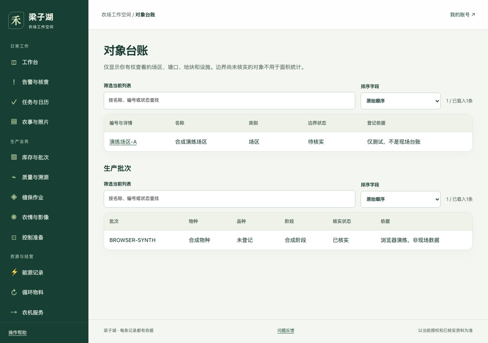

*页首截图来自真实浏览器工程验收，展示的是合成测试对象。下文把截图放到对应功能旁：验收图片标注“合成工程样本”，新截取的本机页面标注其实际数据状态；两者都不代表真实设备或田间效果已验收。*

## 为什么做这个项目

农场的一件事往往跨越多个系统：设备平台提供测值，工作人员在现场处理，照片留在手机里，采购与收发另记台账，负责人最后需要核对这些记录是否对应同一个塘口、地块或批次。

本项目把这些记录关联起来：**看到异常后能追到原始测值，安排工作后能核对实际执行，交付产品后能回查生产、加工与检测依据。** 数据不足、尚未审核或没有反馈时，页面保留这些缺口，方便人员继续核查。

| 使用者 | 主要工作 |
|---|---|
| 农场负责人、值班人员 | 看待办与告警，跟进认领、处置和交班，审阅简报 |
| 现场人员、仓管人员 | 手机记录农事和照片，登记投入品、库存、加工与收发 |
| 技术员、受邀专家 | 核查测值与影像，审核规则、处方、质量和分析依据 |
| 管理员、接入工程师 | 管理对象授权、设备映射、接口契约、后台任务及恢复 |

页面和记录受角色、对象授权及分享范围约束；外部专家只查看明确授权的资料。

## 系统框架与流程

### 软件怎样组成

电脑、手机和客户页共用业务服务；后台进程分别处理较慢的采集、告警、文件和模型任务。地块、塘口、设备与生产批次贯穿各模块，记录和文件都保留对应关系。

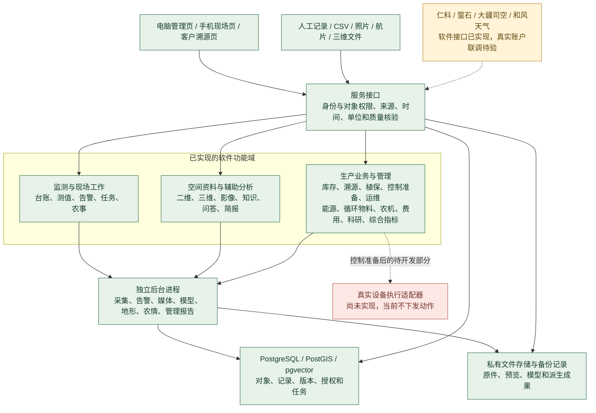

绿色表示软件已有实现与工程证据；黄色表示实际账户、资料和现场验收仍待补齐；红色表示尚未实现。文件备份能力已实现，生产异地恢复和容量仍须另行验收。

### 一条记录怎样形成业务结果

下面展示三条典型工作路径。箭头表示记录关联和工作顺序；派单、质量放行、设备动作与客户内容公开均有各自的人工确认要求。

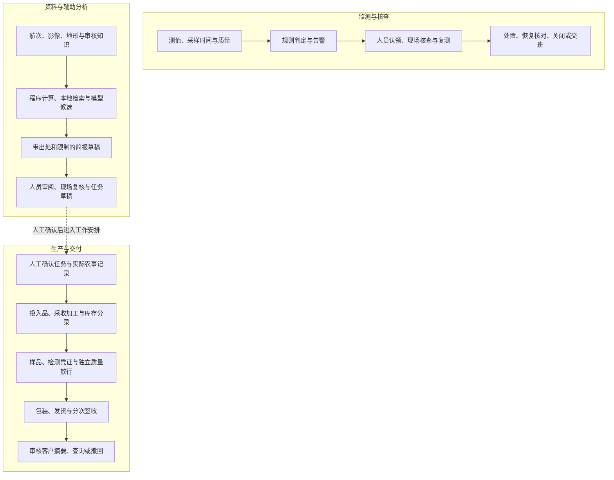

监测数据、库存数量、模型候选和人员结论分别保存。模型给出候选或辅助解释，不会自动完成派单、质量放行或设备控制。

## 功能与场景

### 从一件具体工作开始

1. **一次监测异常**：查看测点的有效值、时间和质量 → 认领告警 → 留下现场核查、人工复测与处置记录 → 核对关闭或交接。厂家实时数据和真实通知须先完成接入验收。
2. **一次现场作业**：从任务与日历找到对象 → 在手机填写农事、拍照 → 离线时保存加密草稿 → 恢复网络并打开应用后同步 → 复核实际执行。页面分别显示本机保存、待同步和服务器已接收。
3. **一批产品交付**：登记投入品与库存 → 记录采收、加工和包装关系 → 关联样品、报告与凭证 → 独立审核放行 → 分别登记发货和签收 → 审核客户可见的溯源摘要。发现问题后可以追查关联批次、记录处置并撤回公开内容。

### 主要能力

| 业务 | 已实现的软件能力 | 页面入口 | 对应截图 |
|---|---|---|---|
| 对象与设备 | 场区、塘口、地块、设备、测点和生产批次；编号映射、来源及变更记录 | `/objects`、`/devices`、`/settings` | [工作台与台账](#工作台和对象台账) |
| 监测与告警 | 有效值、历史曲线、缺测、冲突与更正；告警认领、复测、处置、交班和规则审核 | `/alerts`、`/rules`、`/duty`、`/maintenance` | [监测与处理](#监测告警与历史) |
| 任务与农事 | 审核日历、任务草稿、人工派单、农事照片、离线草稿、CSV 补录与更正 | `/workbench`、`/tasks`、`/records`、`/field.html` | [手机记录](#任务农事与离线记录) |
| 地图与地形 | 二维对象边界和设备点位；私有三维模型、资料核验、实测点剖面及基准记录 | `/map`、`/terrain` | [二维与三维](#二维地图与三维地形) |
| 监控与航次 | 监控事件、后补图片、航次文件清单、私有原件、分块上传及已授权链接下载 | `/imagery` | [航次与原件](#监控与无人机航次) |
| 投入品与库存 | 采购、领用、施用、库存分录、采收加工、包装、发货与分次签收 | `/inventory` | [库存与收发](#投入品库存与收发) |
| 质量与溯源 | 样品报告、凭证、独立放行、上下游批次追查、问题处置、客户摘要审核与撤回 | `/traceability`、`/trace/<code>` | [客户查询页](#质量审核与客户溯源) |
| 植保与农情 | 计划与专业处方、实际轨迹、疑似漏作与重作、标准 JSON 导入、现场复查、农情通知 | `/protection`、`/agronomy` | [作业与影像](#植保作业与农情影像) |
| 分析与助手 | 指标和天气分析、知识检索、权限内问答、简报审阅、图片复核、作物照片与多光谱分析 | `/analysis`、`/knowledge`、`/assistant`、`/briefings`、`/image-review` | [问答与简报](#知识问答与简报审阅) |
| 控制准备与运维 | 控制许可、模式和保护分别登记；申请、分层反馈、人工接管；进程、任务、备份和费用状态 | `/control-records`、`/operations` | [准备与运行状态](#控制准备与运维) |
| 能源与循环物料 | 计量档案、人工/文件观测、差分、称量入库、处理返料和质量去向 | `/energy`、`/circular` | [四期界面](#四期资源经营与科研) |
| 农机与费用补贴 | 五项接入答复、绑定派单、双证据验收、费用实付和三类补贴分账 | `/machinery`、`/business` | [四期界面](#四期资源经营与科研) |
| 科研与综合指标 | 协议、小区/对照、观察与结果快照、经费关联、后台管理报告 | `/research`、`/management` | [四期界面](#四期资源经营与科研) |

完整需求及原定分期见[22 个模块功能总清单](docs/baseline/智慧农业平台功能总清单.md)。该清单同时包含后续规划，不能把清单中的每一项都视为已交付。

### 记录之间怎样衔接

- **数据有出处**：保留来源、对象、原单位、采样与接收时间、质量状态；更正保留原值与理由。
- **计划与结果分别记录**：任务派出、实际作业、交付、签收、审核放行各有自己的记录。
- **数量能够对账**：库存采用不可变分录，采购与施用分开，加工转换与包装关系分开，差额需要解释。
- **缺口能够看见**：缺测不填成零，未知反馈不推断为成功，旧数据补传不冒充新的实时状态。
- **共享可以控制**：内部原件保存在私有存储；专家资料按范围授权，客户摘要独立审核，读取时核对当前状态。

### AI 与影像分析做到哪一步

知识库支持关键词和本地向量检索；问答、辅助解释和简报关联可查看的资料出处，模型不可用时有程序降级路径。本地图片复核、作物照片特征和 SigLIP2 候选模型已跑通工程链；GeoTIFF 处理支持指定条件下的 NDVI / NDRE 计算及私有成果导出。

**这些工程结果尚不能证明田间识别准确率。** 作物候选模型默认关闭，农业效果需要独立标注样本验证；专业阈值、植保剂量、质量放行和设备动作仍由相应人员核实。支持的影像格式、校正与坐标条件见[3C 详细设计](docs/specs/2026-10-03-三期3c植保农情与影像详细设计.md)。

## 功能截图

截图是现有软件的真实浏览器界面，分为两类：**合成工程样本**来自隔离测试库，便于展示完整操作；**本机界面**来自当前开发库，保留尚无现场数据的状态。手机长图可展开查看，不以截图代替现场验收。

### 工作台和对象台账

**已实现：** 按权限展示待办、任务、待核告警与待审简报；对象和批次统一编号。页首为合成台账截图，下图为本机工作台，当前没有录入待办。

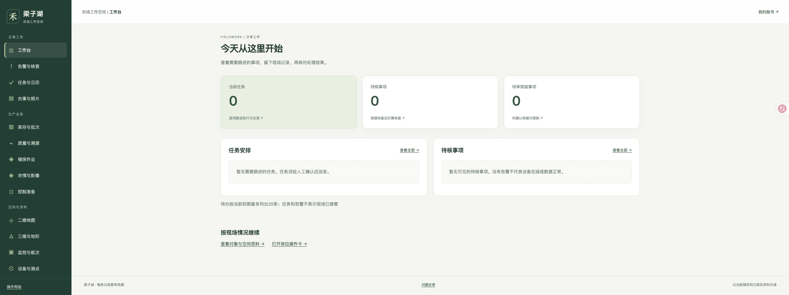

<details>
<summary>查看手机工作台（合成工程验收界面）</summary>

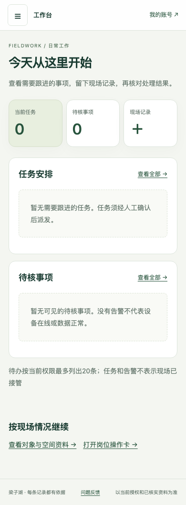

</details>

### 监测告警与历史

**已实现：** 测值和通信状态分开显示，曲线保留缺口；告警按认领、复测、处置、恢复和关闭留痕。**待完成：** 真实测点映射、专业阈值、现场通知渠道和效果验收。

<details>
<summary>查看手机告警处理记录与测点历史（合成工程样本）</summary>

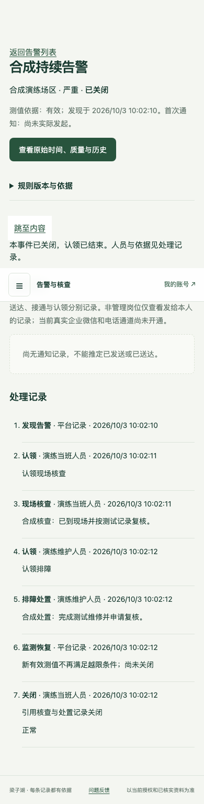
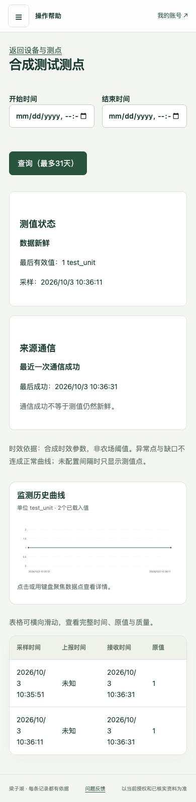

</details>

### 任务农事与离线记录

**已实现：** 人工派单、农事与照片原件、加密离线草稿、打开应用后重连同步，以及 CSV 补录和更正。图中展示合成离线记录已提交，原件和预览分别保存。


### 二维地图与三维地形

**已实现：** 二维对象边界、设备点位、航次覆盖、正射预览与疑点图层；三维私有模型加载、逐资源授权、测绘资料审核、实测点高差与剖面。**待完成：** 全场实测资料、坐标与高程基准、灌排适用精度和真实终端容量验证。

本机地图目前有一个农场入口，尚无已登记边界或设备坐标，页面如实显示“缺坐标”。这不是2000亩田地已完成建模的证明。

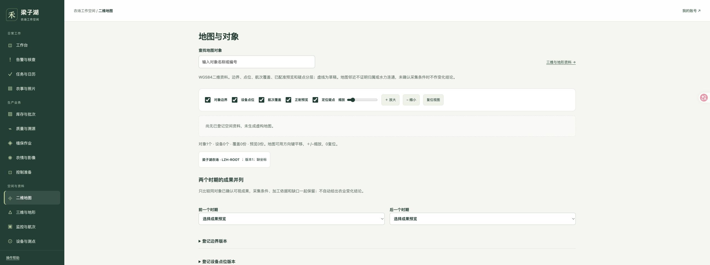

下图是用于验证私有模型加载的合成三角形，标注“仅供展示”，不是梁子湖农场航测模型。


### 监控与无人机航次

**已实现：** 监控事件和后补图片、航次与原片清单、私有原件校验与备份、分块上传、已授权链接下载，以及司空只读任务快照。**待完成：** 实际平台账户、机型与接口版本、媒体权限及真实文件联调。

<details>
<summary>查看司空航次与原件处理页面（合成工程样本）</summary>

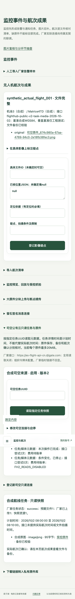

</details>

### 投入品库存与收发

**已实现：** 仓位、库存批号、不可变分录、采购领用与施用、采收加工、包装、发货和分次签收；更正保留依据。**待完成：** 真实仓位、实物盘点、计量口径及收发凭证核对。

<details>
<summary>查看库存、仓位和收发长图（合成工程样本）</summary>

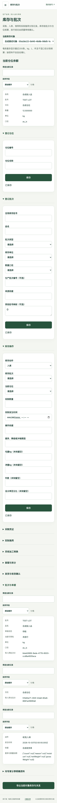

</details>

### 质量审核与客户溯源

**已实现：** 样品和报告、凭证期限、独立质量放行、上下游批次追查、问题处置，以及客户摘要的独立审核和撤回。客户页只显示获准公开的内容。

**待完成：** 真实检测依据、资质、审核人员和可公开客户资料；不会由软件自动判定证书真伪。下图为合成客户页，明确注明不用于实物证明。

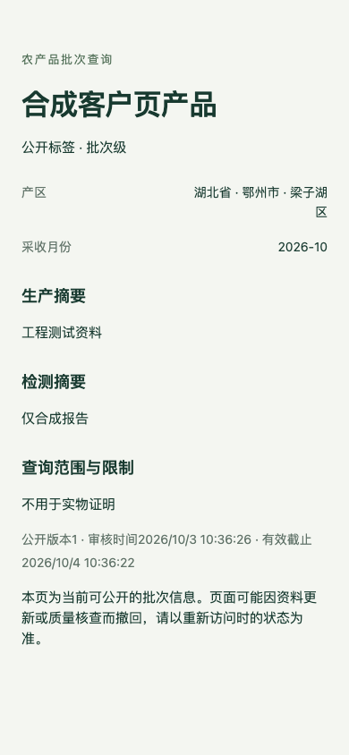

### 植保作业与农情影像

**已实现：** 植保计划和专业处方、实际作业与轨迹、离线文件导入、疑似漏重作核查；作物照片特征、本地模型候选、多波段 GeoTIFF 指数与分区、农情通知和人工修正。

**待完成：** 真实作业文件、专业剂量、独立标注照片、多光谱校正与田间效果验证。照片候选和指数产品不自动转为病害确诊或用药建议。

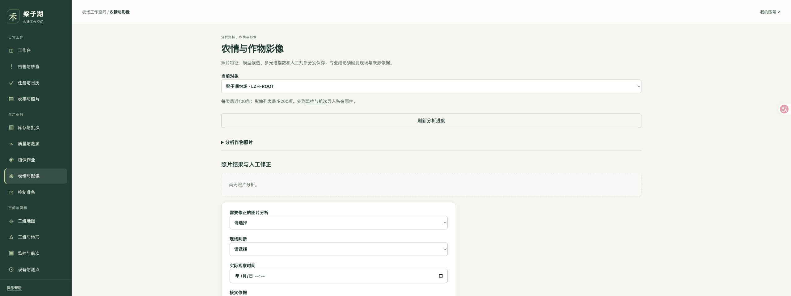

<details>
<summary>查看植保计划、作业导入与缺口记录（合成工程样本）</summary>

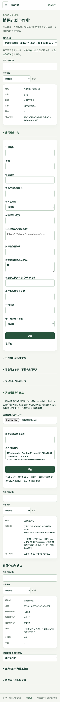

</details>

### 知识问答与简报审阅

**已实现：** 审核知识的关键词与本地向量检索、权限内问答、指标和天气分析、带出处的辅助解释、逐项简报审阅及任务草稿。真实模型不可用时保留程序查询结果。

下图展示合成规程的程序查询，页面说明真实模型外发未启用；它不代表外部模型已完成农场联调。

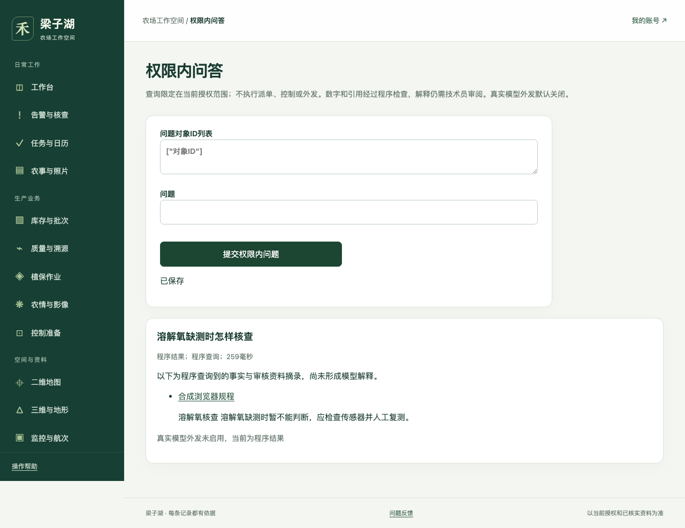

<details>
<summary>查看审核知识与简报审阅长图（合成工程样本）</summary>

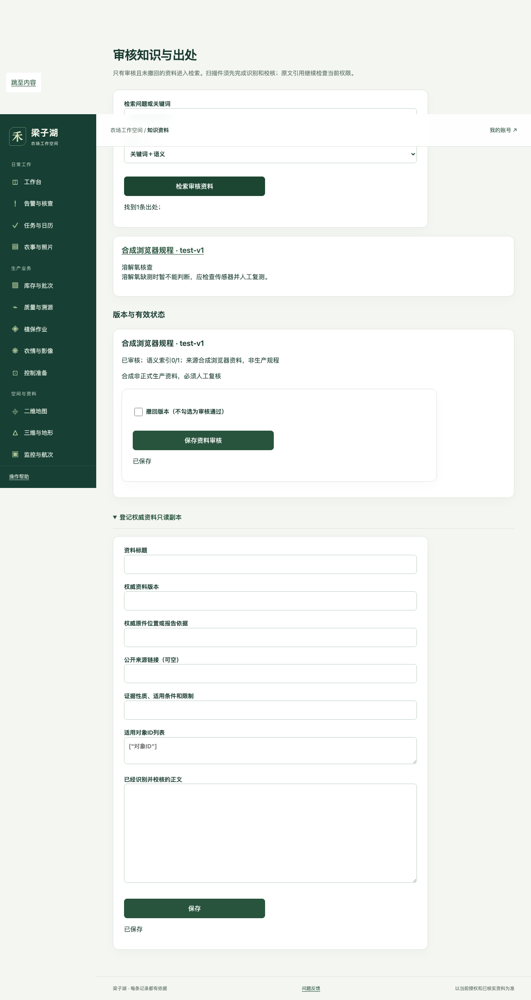
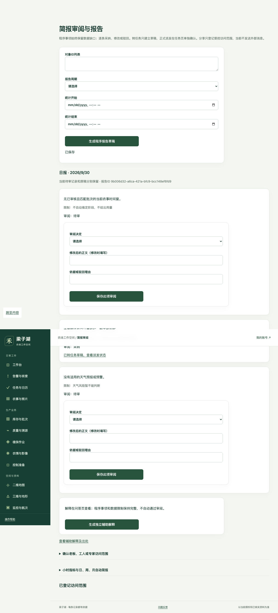

</details>

### 控制准备与运维

**已实现：** 设备许可、模式和现场保护分别登记，专业规则、控制申请、五层反馈与人工接管留痕；后台任务、进程、费用和恢复状态可查看。

**尚未实现：真实设备执行适配器。** 当前页面明确注明不会下发动作，登记申请不能使闸门、泵或增氧机自动运行。生产异地恢复、密钥托管和真实故障演练仍待完成。

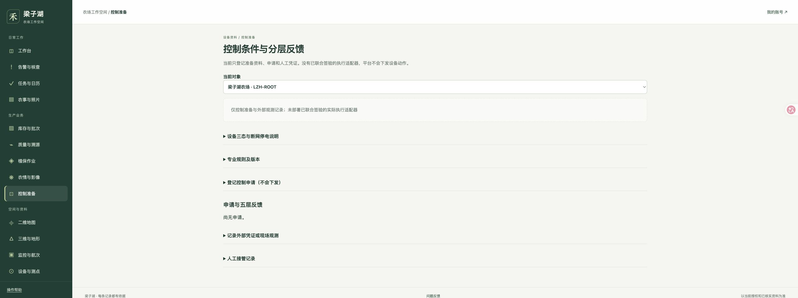

<details>
<summary>查看运行、任务、备份与费用状态（合成工程验收界面）</summary>

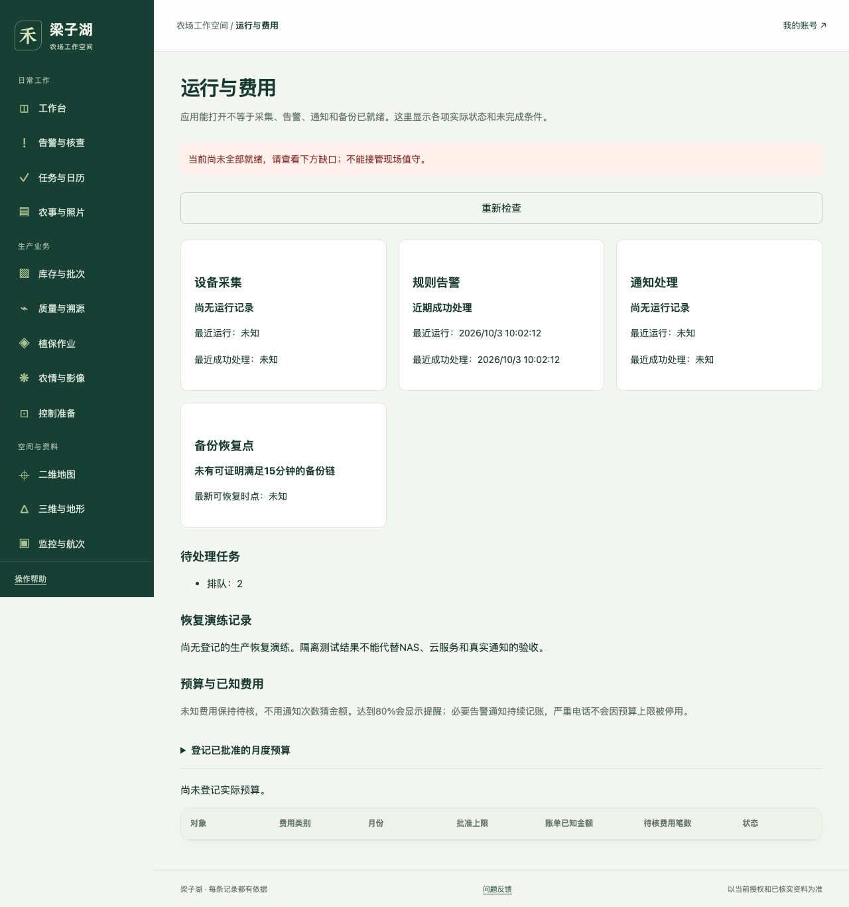

</details>

### 四期资源、经营与科研

**已实现：** 能源与循环物料、农机服务、费用补贴、科研试验和综合指标的通用业务流程。能源值有缺测/复位边界，循环物料沿用库存分录，农机验收区分轨迹和业务证据，费用与付款分开，试验和报告保留历史输入。

四期同时补齐了旧表单换账号误提交、部分导入丢输入、植保文件跨账号重复，以及统一导出遗漏三期关系的问题。[查看复核结果](docs/acceptance/四期前置复核.md)

<details>
<summary>查看四期手机界面（合成工程样本）</summary>

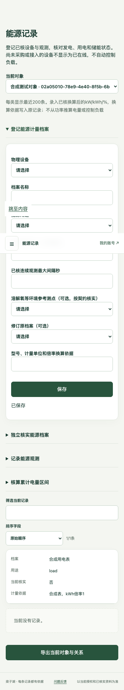
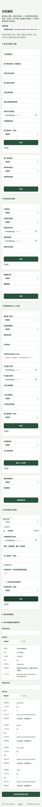
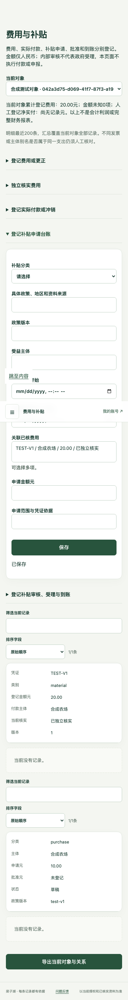
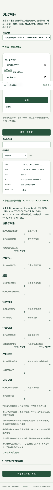

</details>

上面的原有本机截图保留其截取时点的数据状态。四期数据和截图均不能作为真实采购、政府受理、设备接入或田间效果的证明。

## 当前进度

以下是 **2026-10-03 的交付状态**。“软件完成”指已有代码和本地工程证据；现场联调与生产验收按独立清单推进。

| 分段 | 主要交付 | 状态与详细入口 |
|---|---|---|
| 1A 基础平台 | 身份权限、对象台账、监测质量、告警、值班、运维 | 软件完成 · [执行记录](docs/acceptance/1a/实施进度.md) |
| 1B 现场作业 | 农事、离线照片、任务日历、监控与航次原件 | 软件完成 · [设计与测试对照](docs/acceptance/1b/一期1b设计代码测试对照.md) |
| 1C 分析与助手 | 指标、天气、知识、问答、简报、图片复核 | 软件完成 · [设计与测试对照](docs/acceptance/1c/一期1c设计代码测试对照.md) |
| 2A 操作体验 | 桌面与手机导航、工作台、表单和列表 | 软件完成 · [交付目录](docs/acceptance/2a/实施进度与交付物.md) |
| 2B 地图图表 | 地图查找、图层与操作、测点曲线和指标趋势 | 软件完成 · [交付目录](docs/acceptance/2b/实施进度与交付物.md) |
| 2C 三维地形 | 私有模型、资料核验、测量、基准、剖面及专家复核 | 软件完成 · [交付目录](docs/acceptance/2c/实施进度与交付物.md) |
| 3A 库存加工 | 投入品、库存、采收加工、包装与独立收发 | 软件完成 · [交付目录](docs/acceptance/3a/实施进度与交付物.md) |
| 3B 质量溯源 | 样品、凭证、放行、双向追查、处置及客户页 | 软件完成 · [交付目录](docs/acceptance/3b/实施进度与交付物.md) |
| 3C 植保农情 | 植保、轨迹、作物影像、多光谱、农情及控制准备 | 主体完成；实控适配未实现 · [交付目录](docs/acceptance/3c/实施进度与交付物.md) |
| 4A 能源与物料 | 计量观测、区间差分、循环称量、处理与去向 | 通用软件完成；能源厂家适配待资料 · [交付目录](docs/acceptance/4a/实施进度与交付物.md) |
| 4B 服务与经营 | 机具终端、人工派单、独立验收、费用实付、补贴分账 | 通用软件完成；北斗/终端实际适配待资料 · [交付目录](docs/acceptance/4b/实施进度与交付物.md) |
| 4C 科研与指标 | 协议、对照观察、历史结果、经费、七类指标后台报告 | 软件完成；真实科研和覆盖范围待验 · [交付目录](docs/acceptance/4c/实施进度与交付物.md) |


各段的详细设计、实施计划、执行记录、代码测试对照及交付说明，统一从[开发文档入口](docs/README.md)查阅。

**后续顺序**：补齐真实设备、账户、样本和专业条件；按 G15 完成控制适配，按 G16/G17 完成采购后能源及北斗/终端实际适配，再开展现场联合测试、真实业务和生产验收。[四期交接](docs/contracts/四期真实资料与接入适配交接.md)列明具体资料和仍需开发的部分。

### 哪些还没完成

| 类别 | 当前缺口 | 下一步与验收依据 |
|---|---|---|
| **尚未实现的软件** | G15真实设备执行适配器，包含具体协议编码、发送及真实反馈解析；现有控制准备界面不能驱动设备 | 取得实装设备、固件、寄存器和许可后编码，并逐设备联合测试；[G15交接](docs/contracts/三期真实资料与设备适配交接.md#g15-真实设备执行适配器尚未实现的开发项) |
| **通用业务已实现，厂家适配尚未实现** | 采购后能源自动采集、北斗/终端实际HTTP或专有文件适配；当前支持人工/标准文件记录 | 取得采购、接口权益和真实样本后继续适配；[G16/G17交接](docs/contracts/四期真实资料与接入适配交接.md) |
| **已有软件，真实接入待验** | 仁科、萤石及海康归属、大疆司空、和风天气、企业微信和电话等真实账户、权限、样本与回执；部分登录渠道也需真实身份联调 | [一期交接](docs/contracts/真实联调交接清单.md)、[扩展交接](docs/contracts/1b与1c真实联调交接.md) |
| **已有软件，现场效果待验** | 地块和设备空间资料、全场三维成果及高程精度；实际库存和质量凭证；植保轨迹、多光谱、能源计量、费用政策、科研方法及农业效果 | [G11/G12](docs/contracts/二期G11与G12真实验收清单.md)、[G13/G14](docs/contracts/三期真实资料与设备适配交接.md)、[G16—G18](docs/contracts/四期真实资料与接入适配交接.md) |
| **生产运行验收待完成** | 生产HTTPS和接入范围、真实终端与大文件容量、独立密钥托管、异地副本、灾备恢复及现场值守 | 按G06、G11/G12与实际设备条件验收，不能用本机测试代替 |

**当前公开的是项目源码和工程说明，未提供公网在线演示地址。** 本机服务不能直接用`127.0.0.1`向外部人员分享；需要部署与访问配置后再提供应用网址。

## 快速启动

当前提供源码方式的本地启动：Web 与后台进程运行在 Node.js，专属数据库通过 Docker 启动。需要 **Node.js ≥ 22.15.0、pnpm 10.33.0、已启动的 Docker Desktop 和 Git**。首次安装需要下载依赖和数据库镜像。

仓库已公开，新电脑可直接克隆项目；已有工作副本可直接进入项目目录：

```sh
git clone https://github.com/8jdkds7nzz-hub/liangzihu-farm-platform.git
cd liangzihu-farm-platform
pnpm install --frozen-lockfile
pnpm db:setup
pnpm db:migrate
pnpm identity:setup
pnpm registry:setup
pnpm ops:setup
pnpm dev
```

打开 **http://127.0.0.1:3100/login**，使用本机 `.local/初始管理员凭据.json` 中的初始账号登录。该文件被 Git 忽略，没有通用公开密码。首次环境默认要求二次验证；已有环境按自身 `IDENTITY_MFA_REQUIRED` 设置执行，详见[登录配置](docs/help/本地开发与运行.md#登录与首次使用)。

初始化只创建农场入口，**不会生成虚构设备、库存或农事记录**。登录后从“配置管理”登记已核实对象及授权；后台计算、告警和媒体处理须另开进程。

<details>
<summary>启动核心后台进程：每条命令单独开一个终端</summary>

```sh
pnpm worker:alarms
pnpm worker:notifications
pnpm worker:media
pnpm worker:knowledge
pnpm worker:intelligence
pnpm worker:image-review
pnpm worker:terrain
pnpm worker:agronomy
pnpm worker:management
```

向量检索与图片模型首次使用前执行 `pnpm models:prepare`；作物候选实验另用 `pnpm models:crop-prepare`。下载权重需要联网，准备后本地推理使用本机文件。作物候选实验默认保持关闭。

</details>

厂家和天气 worker、私有文件存储、登录设置、验证命令及常见问题见[本地开发与运行](docs/help/本地开发与运行.md)。这组启动步骤用于本地开发与核验；生产部署还须完成密钥托管、恢复和现场接入验收。

## 设备接入与现场条件

| 对接对象 | 当前软件基础 | 仍需完成 |
|---|---|---|
| 仁科监测设备 | 按已核契约执行的只读 HTTP 采集和文件回放 | 实装设备映射、字段、单位、账户与真实报文核对 |
| 萤石及海康监控 | 萤石签名事件接收、只读接入和私有原件链 | 各设备实际平台归属、接口权限、加密及媒体样本；海康不直接套用萤石协议 |
| 大疆机场与司空 | 只读连接、航次与文件清单、原件入库 | 实际机型、平台版本、许可和真实文件联调 |
| 和风天气 | 只读日预报客户端、来源核实和同步记录 | 账户、签名凭据、网格及真实响应核验 |
| 三诚闸门及其他执行设备 | 控制资料、独立审核、申请、五层反馈与人工接管台账 | **真实执行适配器尚未实现**；需要协议、寄存器、反馈语义及现场联合测试 |

真实通知、外部模型请求及厂家读取默认关闭。**控制请求在数据库层保持未下发，不能通过打开环境开关获得实控能力。**

交接清单：[一期基础 G01—G06](docs/contracts/真实联调交接清单.md) · [一期现场与智能扩展](docs/contracts/1b与1c真实联调交接.md) · [二期 G11 / G12](docs/contracts/二期G11与G12真实验收清单.md) · [三期 G13—G15](docs/contracts/三期真实资料与设备适配交接.md)。

## 技术与代码结构

| 层次 | 当前实现 |
|---|---|
| 页面与服务接口 | Next.js 16.3.8、React 19.2.4、TypeScript；桌面与手机共用业务服务 |
| 数据与空间计算 | PostgreSQL 18、PostGIS 3.6、pgvector；追加迁移、版本记录与对象授权 |
| 后台工作 | 独立 Node.js workers，处理采集、告警、媒体、模型、三维及农情任务 |
| 文件与影像 | 私有本地存储 / S3 配置支持；Cesium、GeoTIFF.js、sharp、HLS 播放支持 |
| 本地模型 | Transformers.js；本地向量、图片复核及作物候选实验 |
| 工程验证 | Node.js 测试、隔离 PostgreSQL schema、Playwright 浏览器、实际备份恢复 |

```text
src/app/          页面与 /api/v1 服务接口
src/components/   共用页面组件
src/modules/      身份、监测、农事、库存、质量、植保等业务逻辑
src/db/           数据库连接与迁移
workers/          独立后台进程与本地推理
ops/              数据库环境、健康检查及恢复演练
tools/            初始化、模型评估等开发工具
tests/            单元、数据库与浏览器验收
docs/             基线、设计、计划、验收、交付和操作卡
```

这是独立应用仓库，有自己的锁文件、数据库和私有本机目录。外层“智能体整体方案”是报告与规划工作区，两套应用和数据库分别运行。

## 测试与交付依据

**2026-10-03 四期复核共242个独立测试用例通过**：63项单元、151项数据库、26项HTTP / 浏览器、1项独立监测和1项Python归档。先完成241项全量检查，再增加1项补贴日期用例并定向回归；重复执行没有加计。类型检查、正式构建和冻结安装通过。[查看结果与代码指纹](docs/releases/2026-10-03-四期软件交付核对.md)

四期恢复演练比对了 **191张应用表**，其中 **27张新增表均有测试数据**，并回读7份私有文件。演练在本机隔离测试环境完成，不代表生产规模灾备、异地恢复或田间效果已经验收。[查看恢复证据](docs/acceptance/4c/四期非空恢复实测.json)

日常开发的基本检查：

```sh
pnpm typecheck
pnpm test:unit
pnpm test:db
pnpm build
```

完整浏览器、模型及恢复检查入口见[验证与恢复](docs/help/本地开发与运行.md#验证与恢复)。数据库测试只在 `agri_test` 的随机 schema 内运行，不向开发库写入合成业务数据。

## 文档与协作

| 想了解什么 | 从这里进入 |
|---|---|
| 整体产品范围与原始需求 | [总体设计](docs/baseline/2026-10-01-智慧农业平台-design.md)、[功能总清单](docs/baseline/智慧农业平台功能总清单.md) |
| 各期设计、计划、执行与交付物 | [开发文档总入口](docs/README.md) |
| 现场值班与手机填报 | [值班人员操作卡](docs/help/值班人员操作卡.md)、[现场人员操作卡](docs/help/现场人员农事与离线操作卡.md) |
| 库存、质量、植保与农情 | [3A 操作卡](docs/help/三期3a操作卡.md)、[3B 操作卡](docs/help/三期3b操作卡.md)、[3C 操作卡](docs/help/三期3c操作卡.md) |
| 三维、分析和简报 | [三维操作卡](docs/help/三维与测绘资料操作卡.md)、[分析与简报操作卡](docs/help/技术员分析与简报操作卡.md) |
| 四期能源、经营与科研操作 | [4A操作卡](docs/help/四期4a操作卡.md)、[4B操作卡](docs/help/四期4b操作卡.md)、[4C操作卡](docs/help/四期4c操作卡.md) |
| 本地启动、配置与排错 | [本地开发与运行](docs/help/本地开发与运行.md)、[环境配置示例](.env.example) |
| GitHub 产品与 README 借鉴 | [一期产品借鉴](docs/baseline/开源项目产品经验与智慧农业一期实施借鉴.md)、[三期产品借鉴](docs/specs/2026-10-03-三期范围与开源产品借鉴.md)、[四期产品借鉴](docs/specs/2026-10-03-四期范围与开源产品借鉴.md)、[本次 README 参考说明](docs/specs/2026-10-03-README写作参考与结构说明.md) |

维护与协作通过本仓库进行。有权限的协作者可以在 [Issues](https://github.com/8jdkds7nzz-hub/liangzihu-farm-platform/issues) 记录问题，写明页面、复现步骤、预期结果与实际结果；现场用户也可从应用的“问题反馈”入口提交。提交代码前阅读 [AGENTS.md](AGENTS.md)，同步相关设计、测试和交付记录。截图与日志应隐去账号凭据、联系人和私有原件链接。

**仓库与许可**：当前为公开仓库，尚未声明项目级开源许可证。本文借鉴了 ARIS、Dify、Plane 和 farmOS 的项目介绍方式；引用这些项目不表示它们是本应用的运行依赖。第三方依赖版本以 [package.json](package.json) 和 [pnpm-lock.yaml](pnpm-lock.yaml) 为准。
